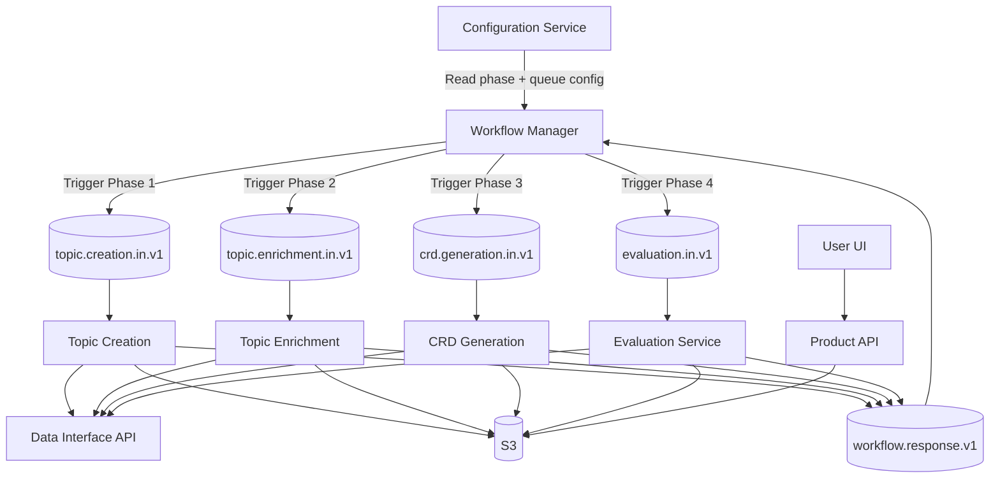
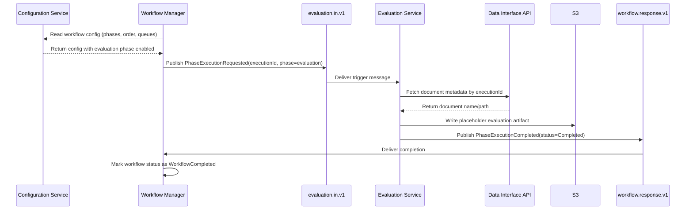

# Attribute Evaluation Framework - Workflow-Orchestrated Architecture

## 1. Objective
Integrate and operationalize the Evaluation Framework as a production-grade fourth workflow phase that is
discovered from Configuration Service and orchestrated by Workflow Manager.

The Evaluation Framework objective is to reliably:
- consume evaluation trigger messages from its configured input queue,
- use `executionId` to fetch required document metadata from Data Interface API,
- generate and store evaluation outputs in S3 using CRD-aligned paths,
- publish completion or failure to Workflow Response Queue so workflow state is accurate.

The design must stay user-impact focused by ensuring that evaluation does not become a bottleneck, document
completion status remains trustworthy, and evaluation outputs are consistently available for downstream APIs
and UI consumption.

## 2. End-to-End Architecture

### High-level components
- Configuration Service (read-only to workflow and phases)
- Workflow Manager (orchestrator)
- Workflow Response Queue (shared completion channel)
- Topic Creation Service (Phase 1)
- Topic Enrichment Service (Phase 2)
- CRD Generation Service (Phase 3)
- Evaluation Service (Phase 4)
- Data Interface API
- S3 Artifact Storage
- Product API for UI integration
- User UI

### Architecture line diagram


## 3. Orchestration Model (Assembly Line)
1. A document execution starts with `executionId`.
2. Workflow Manager reads enabled phases, phase order, and queue names from Configuration Service.
3. Workflow Manager triggers Topic Creation and waits for completion on Workflow Response Queue.
4. After success, it triggers Topic Enrichment and waits.
5. After success, it triggers CRD Generation and waits.
6. After success, it triggers Evaluation Service and waits.
7. Evaluation Service returns success after writing placeholder report output.
8. Workflow Manager marks document status as `WorkflowCompleted`.

Important behavior:
- No phase-to-phase direct communication.
- Every phase responds only to Workflow Response Queue.
- Workflow controls ordering and transition between phases.

## 4. Configuration Contract (Required for Evaluation Phase)
Configuration Service must contain Evaluation phase registration so Workflow Manager can discover it.

```json
{
  "workflowName": "document-processing",
  "version": "1.0",
  "responseQueue": "workflow.response.v1",
  "phases": [
    {
      "name": "topic_creation",
      "order": 1,
      "enabled": true,
      "inputQueue": "topic.creation.in.v1"
    },
    {
      "name": "topic_enrichment",
      "order": 2,
      "enabled": true,
      "inputQueue": "topic.enrichment.in.v1"
    },
    {
      "name": "crd_generation",
      "order": 3,
      "enabled": true,
      "inputQueue": "crd.generation.in.v1"
    },
    {
      "name": "evaluation",
      "order": 4,
      "enabled": true,
      "inputQueue": "evaluation.in.v1"
    }
  ]
}
```

Validation rules:
- If `evaluation.enabled=true`, `evaluation.inputQueue` is mandatory.
- Missing mandatory queue config is a startup validation failure for Workflow Manager.
- Queue names are configuration-managed, not hardcoded in workflow logic.

## 5. Queue Message Contracts

### 5.1 Phase trigger message (Workflow Manager -> phase input queue)
```json
{
  "eventType": "PhaseExecutionRequested",
  "eventVersion": "1.0",
  "messageId": "uuid",
  "correlationId": "uuid",
  "executionId": "exec-123",
  "documentId": "doc-456",
  "phaseName": "evaluation",
  "timestampUtc": "2026-04-14T10:25:00Z"
}
```

### 5.2 Phase response message (phase -> Workflow Response Queue)
```json
{
  "eventType": "PhaseExecutionCompleted",
  "eventVersion": "1.0",
  "messageId": "uuid",
  "correlationId": "uuid",
  "executionId": "exec-123",
  "documentId": "doc-456",
  "phaseName": "evaluation",
  "status": "Completed",
  "output": {
    "s3ArtifactPath": "s3://bucket/path/to/crd/evaluation.json"
  },
  "timestampUtc": "2026-04-14T10:27:00Z"
}
```

### Recommended queue topology
- Workflow response queue: `workflow.response.v1`
- Evaluation input queue: `evaluation.in.v1`
- Retry queue: `evaluation.in.retry.v1`
- Dead-letter queue: `evaluation.in.dlq.v1`

## 6. Evaluation Service - Phase 1 (Integration MVP)

### Responsibilities
- Listen on configured evaluation input queue.
- Parse `executionId` from trigger message.
- Call Data Interface API to fetch document details (at minimum document name/path).
- Create placeholder output artifact (JSON or HTML).
- Write artifact to S3 in same folder/path pattern as CRD outputs.
- Publish completion response to Workflow Response Queue.

### Explicit non-goals in Phase 1
- No full metric computation pipeline.
- No advanced report generation.
- No UI redesign.

## 7. Lifecycle and Status Model

### Workflow lifecycle
- `Queued`
- `Running:TopicCreation`
- `Running:TopicEnrichment`
- `Running:CRDGeneration`
- `Running:Evaluation`
- `WorkflowCompleted`
- `WorkflowFailed`

### Evaluation phase lifecycle
- `Queued`
- `Running`
- `Completed`
- `Failed`

### Sequence diagram


## 8. Hosting and Runtime
### Preferred deployment
- Kubernetes
  - Deployment: Workflow Manager, Evaluation Service listener
  - Job or task model optional for future heavy evaluation compute
  - Horizontal scaling based on queue lag

### Alternative deployment
- AWS ECS/Fargate service per phase listener

## 9. Reliability and Safety Controls
- Idempotency key: `executionId + phaseName`
- At-least-once processing with duplicate protection
- Exponential backoff retries for transient failures
- DLQ routing after max retry attempts
- Correlation id propagation across workflow and phase logs
- Message acknowledgement only after output write + response publish succeed

## 10. Data and Report Publishing

### Storage pattern
- S3 stores CRD and evaluation artifacts under aligned document paths.
- Evaluation Phase 1 writes placeholder output to CRD-aligned path.
- Optional metadata store can track phase status history.

### UI publishing pattern
- Product API may expose:
  - `GET /evaluations/{executionId}/status`
  - `GET /evaluations/{executionId}/report`
- UI renders available output after workflow completion.

## 11. Security and Compliance
- Service-to-service auth via managed identity/service account
- TLS for API and queue transport
- Encryption at rest for storage and optional metadata DB
- Tenant-scoped access controls
- PII-safe structured logs with redaction

## 12. Observability and Operations
Track these metrics:
- Per-phase queue lag
- Phase start latency
- Phase execution duration
- Success/failure rate per phase
- DLQ depth per phase queue

Operational controls:
- Replay from DLQ
- Manual retry by `executionId`
- Alerting on phase failure spikes and queue lag thresholds

## 13. Implementation Blueprint
1. Add evaluation phase queue entry to Configuration Service.
2. Update Workflow Manager to discover phases dynamically from configuration.
3. Add startup validation for enabled phase queue settings.
4. Implement Evaluation Service queue listener using configured queue name.
5. Implement Data Interface API lookup by `executionId`.
6. Implement placeholder JSON/HTML write to S3 in CRD-aligned path.
7. Publish completion/failure response to Workflow Response Queue.
8. Add retries, DLQ, idempotency, and correlation logging.
9. Validate end-to-end status transition to `WorkflowCompleted`.

## 14. Why this design is viable
- Matches the actual assembly-line architecture used by the platform.
- Makes Evaluation phase discoverable via configuration, not code changes.
- Enables low-risk integration first, then iterative enrichment of evaluation logic.
- Preserves workflow control, reliability, and clear completion semantics.
